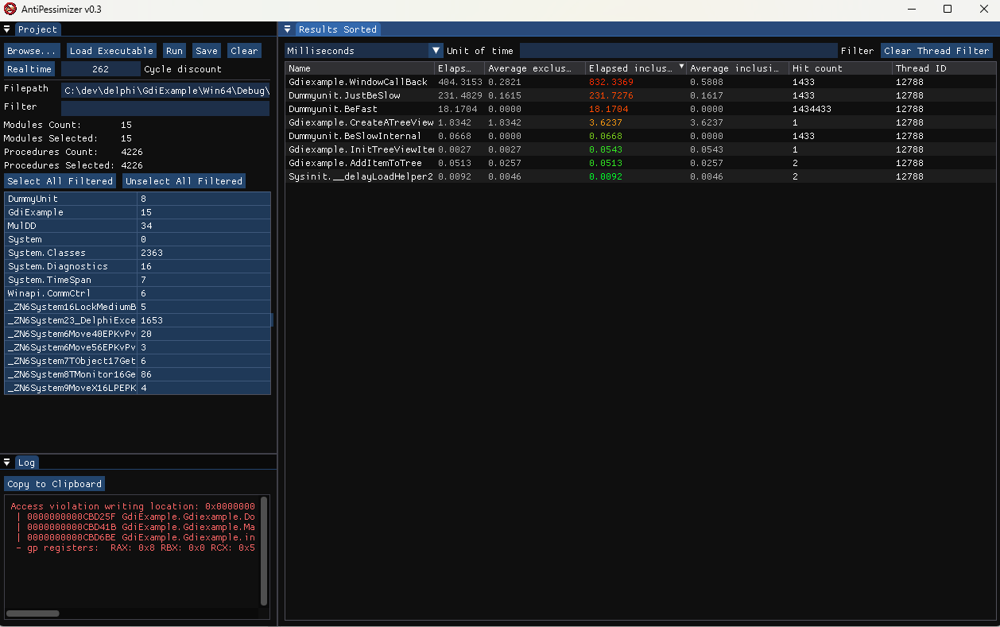

# Antipessimizer

Antipessimizer is a profiling tool for the Delphi language on Windows. It is aimed at finding performance bottlenecks on a general program run to narrow down where to look further.
It works by inserting the profiling code at the start of every procedure in the modules selected and running it, keeping the data within the profiled process and streaming it to the interface gui through a duplex pipe.

This project uses `LibUdis86` which is precompiled in the `lib` directory along with its license. If you want to compile yourself, you can get the source code at https://github.com/vmt/udis86, steps on how to compile this library will not be provided.

## Build

To build the GUI interface, you need to have Visual Studio installed, there are two alternatives.
	- Running `build.bat` in the Visual Studio console window.
	- Compiling using the provided solution.

To build the Delphi DLL you need to compile it using the delphi Project provided (`delphi/AntipessimizerDLL.dproj`) it works with Delphi 10.4 an above.

Once everything is built, you can optionally generate a distributable version running `build_release.bat` which will generate the required files in the `Antipessimizer` directory.